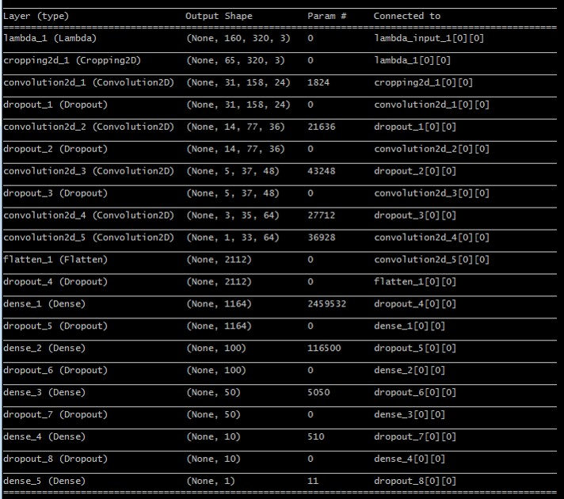
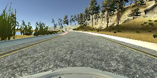
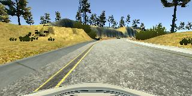
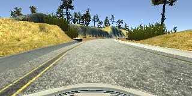
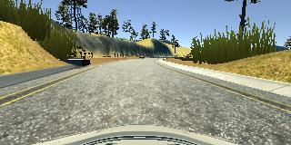
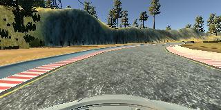
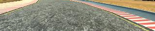
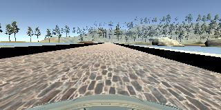
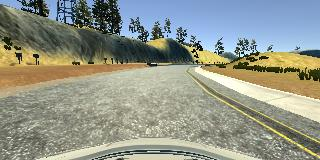
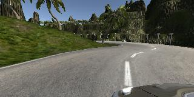

# 1. Submitted Files

My project includes the following files:

1. model.py  - the script used to train and save the model
2. drive.py  - the script used to drive the car in autonomous mode
3. model.h5  - an hdf5 file containing the trained model weights
4. writeup_report.md - this report which summarizes my methodology and results
5. defineModel.py - the script that contains the function for generating the model

# 2. Instructions for Driving the Car Autonomously

The car cand be driven in the simulator autonomously by typing at the command prompt:

python drive.py model.h5

# 3. Code Usability and Readability

The script model.py contains the code for training and saving the convolutional neural network. Note that this script imports a separate script, defineModel.py, to create the model. Note also that I save the model weights in model.h5, not the entire model. At one point I was running into problems with saving and loading the model, and decided to try saving just the weights. I used a separate script to hold the function the creates the model since this same function is needed by both model.py (for training the model) and drive.py (for reloading the model). Comments are included in model.py to explain how the code works.

# Model Architecture and Training Strategy

# 1. Model Architecture

My model is contained in defineModel.py. It consists of five convolutional layers followed by a five-layer fully-connected network. The first three convolutional layers (lines 21, 24, and 27) use a 5x5 kernel and perform 2x2 subsampling with valid padding. The number of features generated by these layers are 24, 36, and 48. These three layers are followed by two additional convolutional layers (lines 30 and 32), both using a 3x3 kernel with 1x1 subsampling and valid padding. Both of these layers generate 64 features. These convolutional layers are following by five fully-connected layers (lines 36, 38, 40, 42, and 44) with 1164, 100, 50, 10, and 1 nodes. This scheme mimics the NVIDIA network that was described in the "Even More Powerful Network" discussion.

A lambda layer (line 18) is used to normalize the data prior to processing through the network, and ReLU activations (included in the convolutional and fully-connected layer lines) are used through the convolutional and fully-connected layers to introduce nonlinearity. A cropping layer (line 19) was used to crop the lower and upper portions of each image to focus on just the road.

# 2. Attempts to Reduce Overfitting in the Model

Dropout (lines 22, 25, 28, 35, 37, 39, 41, and 43 of defineModel.py) was used after the first three convolutional layers and all but the last fully-connected layer to reduce model overfitting.

The input data was split into training and validation sets (line 36 of model.py) to prevent overfitting during training. A final test of the trained model was conducted by running the car with the model in autonomous mode and ensuring that it stayed on the track for the entire loop.

# 3. Model Parameter Tuning

I used an Adam optimizer (line 96 of model.py) to train the model. I chose this particular optimizer since it conveniently updates the learning rate throughout the course of training without the need for manual tuning.

I also used the left and right images along with the center image for each time update when training the model. Thus, I needed to include a correction factor for the steering angles. I chose a value of 0.3, which seemed to work well when I observed the car running in autonomou mode.

# 4. Appropriate Training Data

To train the model, I collected a few loops of the car driving in the center of the road, another swerving from one side of the road to the other, and another driving in the center of the road but in the reverse direction. These data comprised my primary dataset. A secondary dataset was generated focusing on particular problem areas, such as crossing the bridge and turns with no lane markers. In this secondary dataset, I also included one lap around the second course.

For details about how I collected the data, see the next section.

# Model Architecture and Training Strategy

# 1. Solution Design Approach

The overall strategy for deriving a model architecture was to start with a known architecture and make adjustments to it as necessary. I chose to start with the NVIDIA architecture discussed in the course materials since that architecture was used to solve a very similar problem, and since notes from Paul Heraty (a previous nano-degree student) indicated that it should work for this problem as well. In the end, I kept this architecture essentially as-is, adding only dropout layers to reduce over-fitting.

In order to gauge how well the model was working, I split my image and steering angle data into a training and validation set. I found that the training error was reduced steadily with each epoch but the validation error remained high. This was a clear indication of over-fitting.

To combat this over-fitting, I added dropout layers after the first three convolutional layers and all fully-connected layers (lines 22, 25, 28, 37, 39, 41, and 43 in defineModel.py). I also added a dropout layer (line 35) after the flattening layer (line 34) since this was recommended by one source from a Google search for good dropout strategies. After adding the dropout layers, both the training and the validation error were reduced with each epoch, although I did see some fluctuations in the validation error (i.e., reducing then rising slightly before reducing again) even with a relatively high dropout probability of 0.5. 

Note that there are two variables for dropout probabilities in defineModel.py: convDropoutProb and fcnDropoutProb (lines 14 and 15). I initially tried using separate values for the convolutional layers and the fully-connected layers, but ultimately decided to assign both variables a value of 0.5 since this seemed to help mitigate over-fitting the best.

After much trial and error in which I tried collecting new data, changing the model around, adding dropout layers, changing the dropout probability values, and adding in the left and right camera images along with their flipped versions, I finally settled on the architecture and primary dataset described above. I trained the model and used it to run the car in autonomous mode. The car drove very well in all but two places: the bridge and the turns with no lane markers. I then decided to keep this model as a baseline, collect more data focusing on these problem areas (see above discussion of secondary dataset), and then retrain just the fully-connected layers of my model with this new data. Thus, I added a transfer learning capability to model.py.

At the end of the process, the vehicle is able to drive autonomously around the track without leaving the road.

# 2. Final Model Architecure

The final model architecture (defineModel.py lines 17-44) consisted of a convolution neural network with the following layers, layer sizes, and number of parameters:

# 3. Creation of the Training Set and Training Process 

To capture good driving behavior, I first recorded two laps on track one using center lane driving. Here is an example image of center lane driving:

I then recorded the vehicle recovering from the left side and right sides of the road back to center so that the vehicle would learn to steer back towards the center if it got too far over to the sides. These images show what a recovery looks like starting from the far left of the road:

In order to get more data points and improve generalization, I collected one lap driving in the reverse direction, and one lap around the second course (which was much more difficult to drive!).

To augment the data sat, I also flipped images and angles thinking that this would improve the model's generalization. For example, here is an image that has then been flipped:

As a preprocessing step, I also cropped each image (line 19 of defineModel.py) to remove the car's hood and the scenery from each image so the training could focus solely on the road. Here is an example of a cropped image:

I trained the model with this primary dataset and eventually managed to get the car to drive a nearly-perfect lap in autonomous mode. However, when the car reached the bridge, it would steer directly into the wall. During other training iterations, I noticed that the car would often run off the road when it got to the portion of the lap where the lane markers disappear, leaving only a dirt border on one side. Since the model was doing so well other than these limited problems, I decided to collect another full lap in both the clockwise and the counter-clockwise directions, and focused in particular on these problem areas by recording the car driving through them over and over again. For improved generalization, I also collected a lap around track two. I then re-trained only the fully-connected layers of the model (I figured that the model had already done a good job of feature generation via the convolutional layers).

Here are a couple of images showing these problem areas:

Here is an image showing the car drive track two:

After the collection process, I had a primary dataset containing 106,158 images (including center, left, right images and their flipped counterparts) and a secondary dataset containing 23,646 images. These were split into training and validation sets randomly with an 80%/20% split (line 36 of model.py).

I used this training data for training the model. The validation set helped determine if the model was over or under fitting. The ideal number of epochs was 10 as evidenced by a flattening out of the training and validation errors around this number of epochs. I used an adam optimizer so that manually training the learning rate wasn't necessary.
